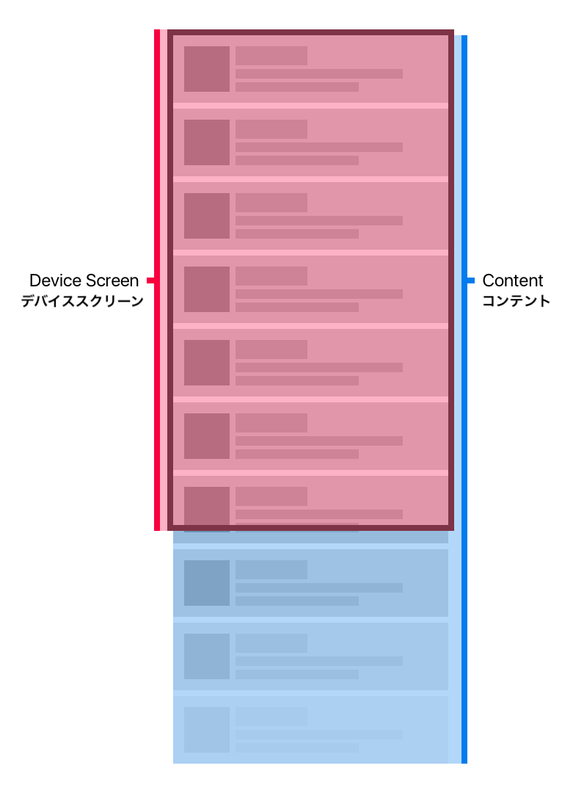
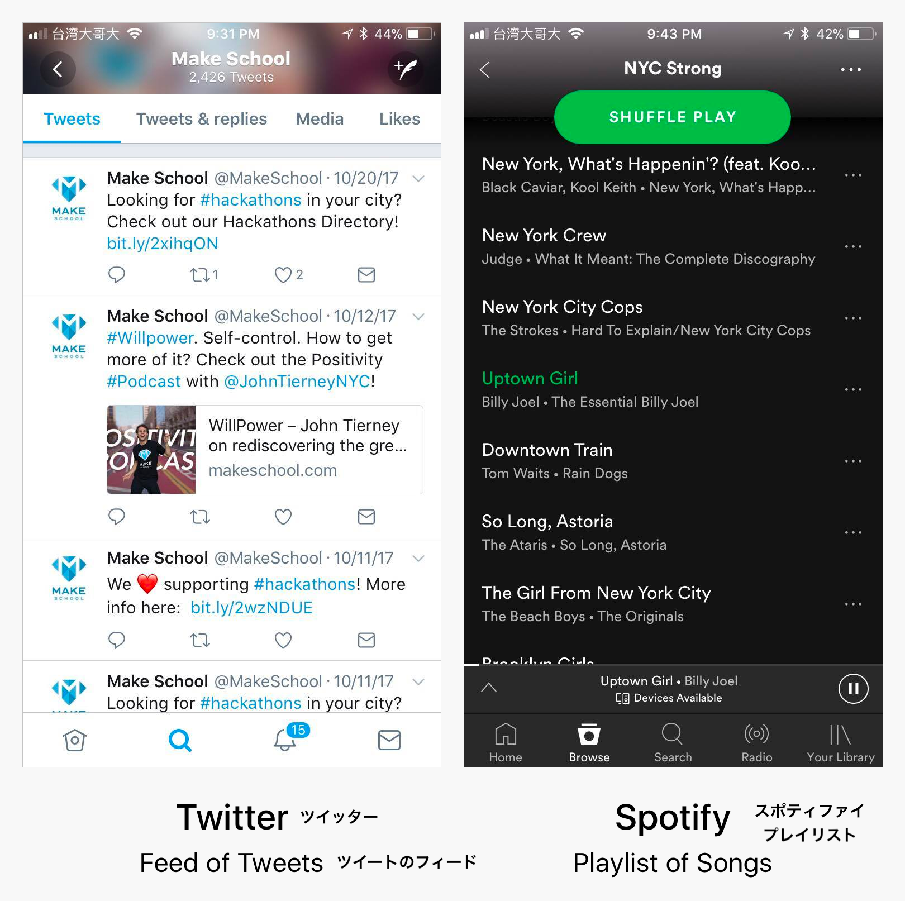

ここまで作ったアプリの中で、`UIKit`や _Auto-Layout_ を使ってUIレイアウトを作るやり方を学びました。でももし、全てのコンテンツがどうしても画面に収まりきらなかったらどうしますか？



上の例のように、フィードやコンテンツリストに特に共通しています。



Twitterは縦にスクロールができるレイアウトを使っています。同様に、Spotifyも曲のリストにUIレイアウトを使っています。

このUIレイアウトを作るために、新しい`UIKit`を紹介します: `UITableView` です。テーブルビューは縦や横にスクロールができるようにしてくれます。

`UITableView`の中には1つ以上の`UITableViewCell`が入っていて、スクロールができるリストを作ります。一番基本的な例は、`UITableViewCell`は一つのアイテムを示します。Twitterの例では、一つ一つのツイートが、`UITableViewCell`です。


左側には、`UITableView`の _frame_ が見えます。このテーブルビューの中に、`UITableViewCell`でできたツイートがみられますね。

> [info]
実は、`UITableView`は多くのことができます。カスタマイズをしてヘッダーを加えたり、いくつかのセクションを加えたりすることができます。このチュートリアルでは、基本の使い方に縛りますが、もし興味がある人は[こちら](https://www.makeschool.com/tutorials/swift-concepts-explained/table-views)をチェックしてみましょう。

次に、`UITableView`の作り方を見てみましょう。

# UITableViewController を使う

このノートアプリでは、`UIViewController` のサブクラスである、`UITableViewController`を使います。`UITableViewController`は`UIViewController`の上に`UITableView`が乗っかったものです。

スタータプロジェクトはtable view controllerが既に作成されています。開けてみましょう。

> [action]
_Project Navigator_ を使って、`Main.storyboard`を開きましょう。

`UITableViewController`はシンプルなリストに最適です。なぜなら、本来ならテーブルビューを作成するために自分で書かなければいけないコードを抽象化して使いやすくしてくれているからです。

次に、Swiftファイルと共に、ストーリーボードテーブルビューコントローラを繋げます。`ListNotesTableViewController`とストーリボードのテーブルビューコントローラを繋げましょう。

> [action]
`Main.storyboard`を開き、`UITableViewController`カスタムクラスに設定しましょう。
>
1. _Interface Builder_ もしくは _Document Outline_ にある、ストーリーボードのテーブルビューコントーラを選択しましょう。
1. _Utilities area_ の _Identity Inspector_ を開きましょう。
1. _Custom Class_ セクションの _Class_ を、`ListNotesTableViewController` に設定しましょう。
>


ストーリーボードテーブルビューコントローラのサブクラスとして、`ListNotesTableViewController` を設定したので、Swiftコードとこのビューコントローラーがつながりました。`ListNotesTableViewController.swift`ファイルにコードを追加していきましょう。

# テーブルビューセルを表示する

`UITableViewController` サブクラスを使って、シンプルなテーブルビューセルを表示する方法をみてみましょう。

まず、テーブルビューコントローラーのソースファイルを開きます。

> [action]
_Controller_ グループ の中の `ListNotesTableViewController.swift` を開きましょう。


`ListNotesTableViewController` のクラスが今のところ空ですが、ここにテーブルビューコントローラに関係するコードを加えていきます。

## データソースメソッドを実装する

`UITableViewDataSource`は、`UITableViewController`の中に隠れています。このメソッドはテーブルビューセルを表示するのに非有ような情報をテーブルビューに与えているのです。

`UITableViewDataSource`の重要な二つのメソッド:

```
public func tableView(_ tableView: UITableView, numberOfRowsInSection section: Int) -> Int

public func tableView(_ tableView: UITableView, cellForRowAt indexPath: IndexPath) -> UITableViewCell
```

> [challenge]
上のコードが何をしているか当ててみましょう。

<!-- break -->

> [solution]
`tableView(_:numberOfRowsInSection:)`は`UITableView`に、いくつの`UITableViewCell`が表示されるべきかを教えてきます。numberOfRowsInSectionというパラメタが何を示しているのか気になるかもしれません。先ほど少し触れたように、テーブルビューは既にたくさんの機能を持っていて、複数のsectionを持つというのもその一機能です。デフォルトでは、`UITableView`は `0` から始まる１つのセクションを持っています。

>
`tableView(_:cellForRowAt:)`は、`IndexPath`の位置の`UITableViewCell`を生成して返します。`IndexPath`は、そのセルの列とセクションの番号を含んだシンプルなデータです。

よりよく理解するために、Table View Controllerに実装してみましょう。

> [action]
>
```
override func tableView(_ tableView: UITableView, numberOfRowsInSection section: Int) -> Int {
    // 1
    return 10
}
>
override func tableView(_ tableView: UITableView, cellForRowAt indexPath: IndexPath) -> UITableViewCell {
    // 2
    let cell = tableView.dequeueReusableCell(withIdentifier: "listNotesTableViewCell", for: indexPath)
    cell.textLabel?.text = "Cell Row: \(indexPath.row) Section: \(indexPath.section)"
>
    return cell
}
```

この _データソース_ を実装することで、テーブルビューコントローラの`UITableView`に何を表示するべきかを伝えることができました。上のコードでやっていること:

1. テーブルビューは10つのテーブルビューセルを表示する。
1. テーブルビューセルを返す。加えて、`UITableViewCell`はデフォルトでセルのindex pathを表示する設定にする。

<!--> [info]
There's a little more happening behind there scenes here!
>
1. First, our `UITableView` is using the _delegate pattern_ to communicate with the `UITableViewController`. As we've already mentioned, the table view needs to know the number of cells to display and cell instance for each index path. The _delegate pattern_ provides a specific way for one object to communicate with another. Usually, we'd have to set this up manually, but our `UITableViewController` does this for us behind the scenes. You can learn more about the _delegate pattern_ by clicking [here](https://www.makeschool.com/tutorials/swift-concepts-explained/delegates).
1. When we retrieve our `UITableViewCell` instance, we use the method `dequeueReusableCell(withIdentifier:for:)` to retrieve the instance of our `UITableViewCell` at a specific index path. This method hides some optimizations that determine if the table view will reuse a previously created cell or initialize a new cell instance. This prevents our app from creating a potentially infinite number of cells as we keep scrolling!
1. Finally, let's discuss the table view cell's identifier. The identifier is a unique string that allows us to connect our code to the correct `UITableViewCell` subclass. Before running our app, we'll need to set our identifier in our storyboard.
-->
## Cell IDを設定する

テーブルビューセルを繋ぐために、セルのIDを設定する必要があります。

> [action]
`Main.storyboard` を開いて、`UITableViewCell`を設定しましょう:
>
1. _Document Outline_ から`UITableViewCell` を選択する
1. _Utilities area_ の _Attributes Inspector_ を開く
1. _Identifier_ を探して、`listNotesTableViewCell`と入力する 

## アプリを実行する

IDを設定し終わったら、一度アプリが動くか確認してみましょう。シミュレータを実行しましょう。

下の画像のようなものが見えるはずです:


> [info]
index pathのrowがそれぞれのセルの番号と一致していることに気づきましたか？

初めのTable View Controllerを設定できましたね！もし上手くいかないようだったら、初めの方に戻って何か飛ばしていないか確認しましょう。Cell IDのタイプミスはよく見られる間違いです。

次のセクションでは、table view cellをカスタマイズして、ノートのタイトルと編集時間を表示させるようにします。
